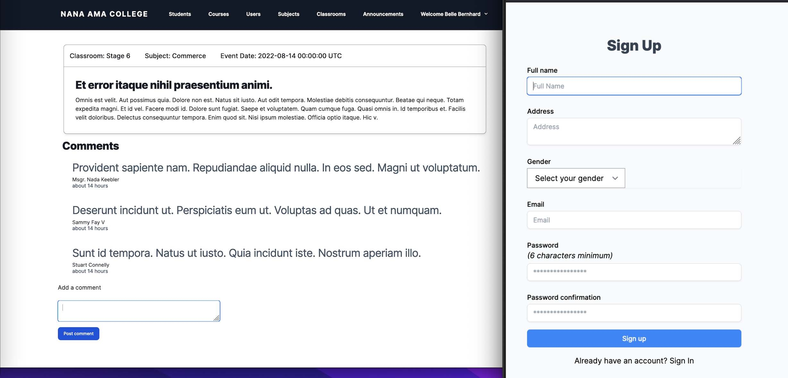

# Nana Ama School Management System



> In this application we building a school management system using Ruby on rails. It authentication, authorizations and permissions based on roles.

## Built With

- Ruby
- Ruby on Rails
- Bootstrap

## Getting Started

To get a local copy up and running follow these simple example steps.

### Prerequisites

- Node.js version 16.4.2
- Ruby version 3.0.2
- Rails version 6.1.6.1

### Setup

- Simply copy and paste this command into your terminal to get everything up and running

  ```
  rvm install 3.1.2 && rvm use 3.1.2
  gem install rails -v 6.1.6.1
  git clone https://github.com/learnwithalfred/redesigned-octo-robot.git && cd redesigned-octo-robot
  bundle install && yarn
  rails db:migrate
  rails db:seed
  ./bin/dev

  ```

- Login as admin to perform all functionalities

  - Email: `admin@example.com`
  - Password: `password`

- Login as student
  - Email: `student@example.com`
  - Password: `password`

## Test

Run all test with `rails test -v`

## Authors

👤 **Alfred Boateng**

- GitHub: [@learnwithalfred](https://github.com/learnwithalfred)
- Twitter: [@kb_alfred](https://twitter.com/kb_alfred)
- LinkedIn: [@learnwithalfred](https://www.linkedin.com/in/learnwithalfred/)

## 🤝 Contributing

Contributions, issues, and feature requests are welcome!

Feel free to check the [issues page](../../issues/).

## Show your support

Give a ⭐️ if you like this project!
